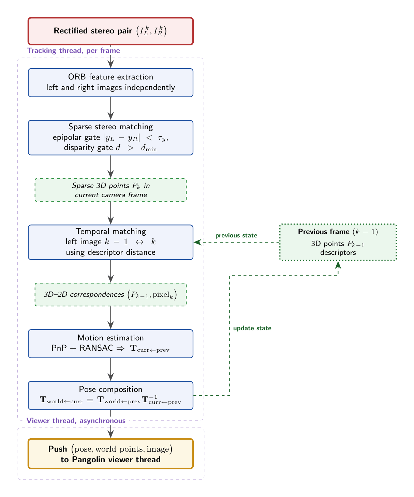
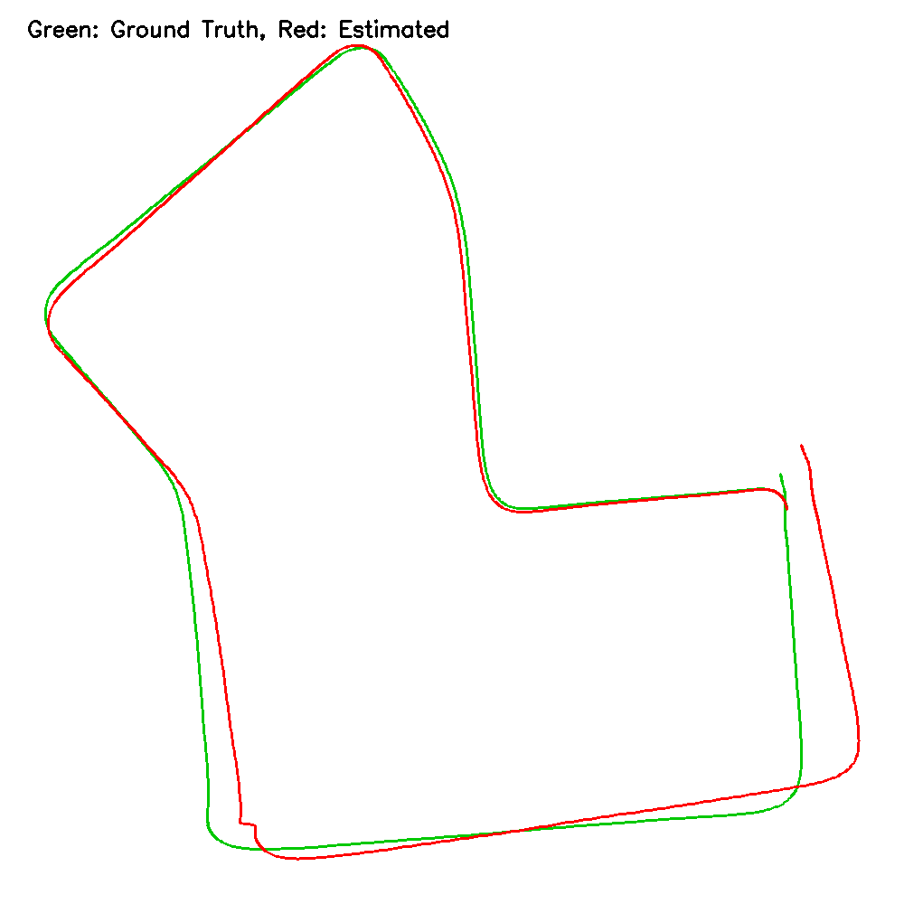
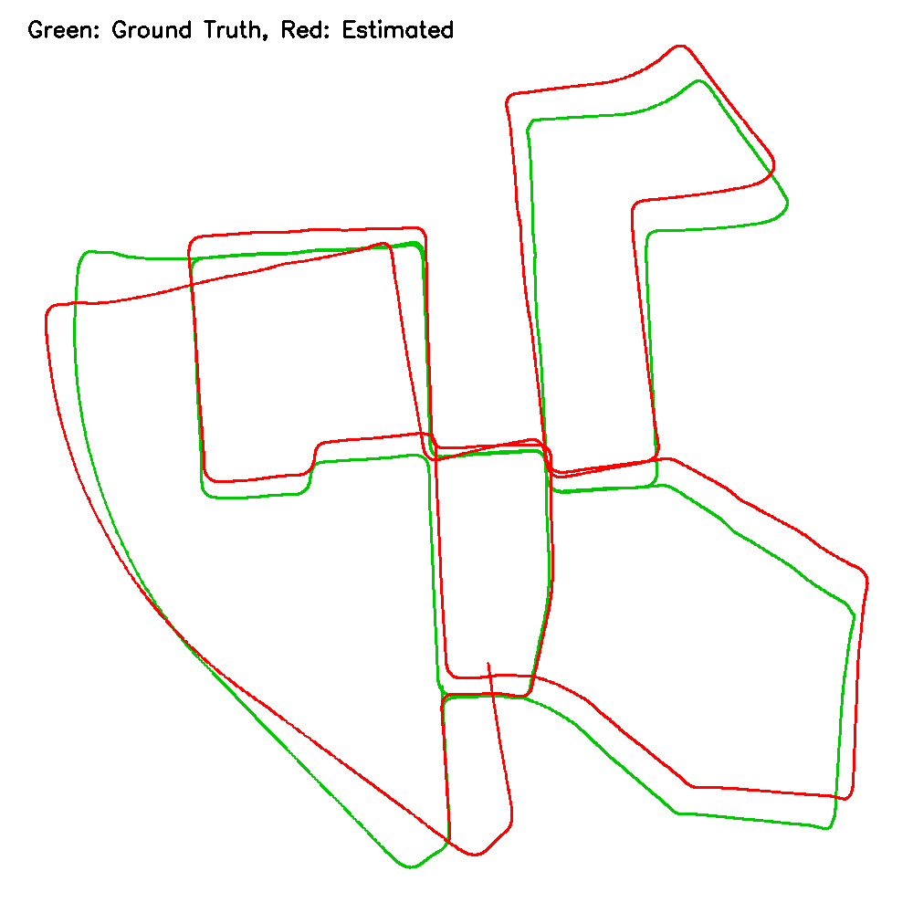
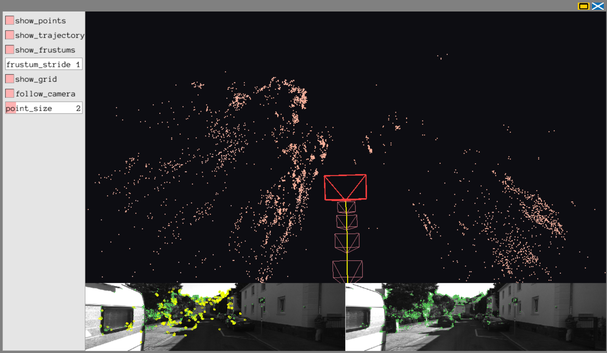
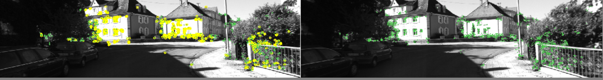
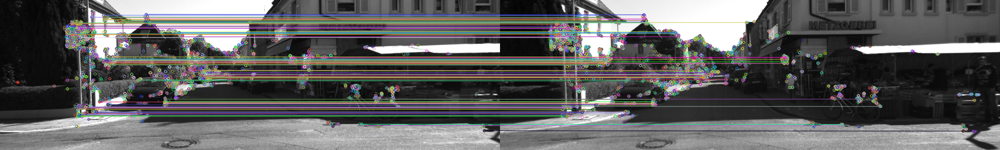
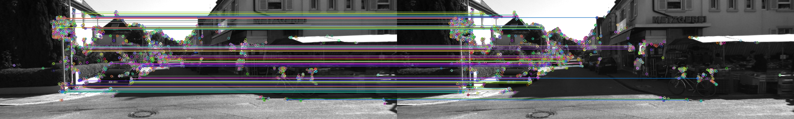

  <strong>Anas Badr</strong> ·
  <a href="mailto:anas.badr@ejust.edu.eg">anas.badr@ejust.edu.eg</a> 
  Egypt-Japan University of Science and Technology 
  <a href="https://github.com/k3rnel-pan1c-a/monoslam/">github.com/k3rnel-pan1c-a/monoslam</a>

## Abstract

Visual odometry (VO) is the task of recovering a camera's 6-DoF trajectory from its image stream alone, and is the perception backbone of self-driving cars, augmented reality, and autonomous drones. We present a stereo VO system inspired architecturally by ORB-SLAM 2/3, simplified to a feature-based frontend (no IMU, no loop closure, no full bundle adjustment) and implemented from scratch in C++ on top of OpenCV and Pangolin. The system extracts ORB features in each rectified stereo pair, matches them between left and right to obtain metric depth, tracks them temporally to form 3D-2D correspondences, and recovers per-frame motion via PnP with RANSAC. Evaluated against KITTI ground-truth poses, the system achieves a final-position drift of **1.44%** on sequence 07 (9.09 m ATE RMSE over a 695 m closed loop) and **1.02%** on sequence 00 (22.96 m ATE RMSE over 3.7 km of urban driving), comfortably below our 10% target and within striking distance of full-pipeline SLAM systems despite running with no backend optimisation. Per-frame relative pose error is 0.39 m / 0.39° (seq 07) and 0.29 m / 0.66° (seq 00) over a 10-frame window. A hand-held capture from a ZED stereo camera demonstrates real-time qualitative operation on previously unseen indoor/outdoor data.

<figure>
  <video autoplay loop muted playsinline width="100%" style="border-radius: 4px;">
    <source src="assets/teaser_2.mp4" type="video/mp4">
    Your browser does not support the video tag.
  </video>
  <figcaption><strong>Figure 1 (teaser).</strong> Live Pangolin visualization on KITTI sequence 07. Yellow line is the estimated trajectory; the red wireframe is the current camera; faint pink/blue frustums are past poses; scattered points are the accumulated sparse map; the strip below is the current rectified stereo pair, with extracted ORB keypoints overlaid in soft green and PnP inliers highlighted in yellow.</figcaption>
</figure>

## 1. Introduction

Visual odometry is the building block on top of which most modern visual SLAM systems are constructed: given a calibrated stream of images, recover the relative motion of the camera frame by frame, and integrate it into a global trajectory. Reliable VO is what allows a self-driving car to know where it is between GPS fixes, what lets an AR headset keep virtual content stable in the real world, and what gives a quadrotor the ability to fly indoors without external positioning. The problem is non-trivial because a camera alone cannot directly measure scale or absolute orientation — pose has to be inferred from how the projected image of the world changes between consecutive frames.

Approaches to visual odometry split along three axes. **Sensor:** monocular (single camera, scale-ambiguous), stereo (calibrated rig, metric scale from disparity), and RGB-D (active depth sensor). **Algorithm family:** feature-based methods such as ORB-SLAM [[1](#ref1), [2](#ref2)] extract sparse keypoints, match them across frames, and minimize reprojection error; direct methods such as DSO [[8](#ref8)] skip features entirely and minimize photometric error. **System completeness:** pure VO produces a pose chain that is allowed to drift, while a full SLAM system adds a backend (bundle adjustment), loop closure, and persistent map management to bound drift over long trajectories.

This project implements a **feature-based stereo visual odometry frontend** inspired by ORB-SLAM 2 and ORB-SLAM 3, simplified to focus on the parts that fit a one-semester scope. There is no IMU integration, no loop closure, and no full bundle adjustment; the architecture, however, is laid out so that those components could be added later without restructuring the codebase. The intent is not to advance the state of the art — ORB-SLAM 3 already operates at production quality — but to produce a complete, from-scratch implementation that exercises every step of the multi-view-geometry pipeline (feature extraction, stereo triangulation, PnP, pose composition, evaluation) and to back it with a strong real-time 3D visualization that makes the system's behavior transparent to a viewer.

## 2. Approach

### 2.1 System overview

<figure>
  
  <figcaption><strong>Figure 2.</strong> Pipeline overview: stereo image pair → ORB features (left + right) → stereo matching → 3D points (camera frame) → temporal matching (left k−1 ↔ left k) → 3D-2D correspondences → PnP+RANSAC → relative pose → global pose accumulation → Pangolin viewer (separate thread).</figcaption>
</figure>

The system processes each stereo frame through a fixed sequence of stages. The implementation is organised into single-responsibility C++ classes (`Frame`, `Calibration`, `KittiDataset`, `FeatureExtractor`, `StereoMatcher`, `MotionEstimator`, `Trajectory`, `Viewer`) that mirror the corresponding modules in ORB-SLAM 2 at a smaller scale.

for each stereo pair (I_L, I_R) at time k:
    extract ORB features in I_L, I_R
    match L &lt;-&gt; R features (epipolar + disparity filter)
    triangulate matched pairs -&gt; 3D points P_k (camera frame)
    if k &gt; 0:
        match I_L(k-1) features &lt;-&gt; I_L(k) features
        build 3D-2D correspondences (P_{k-1}, pixel_k)
        T_curr_prev = solvePnPRansac(...)
        T_world_curr = T_world_prev * inverse(T_curr_prev)
    push (T_world_curr, P_k_world, image) to Viewer

### 2.2 Feature extraction

We use the **ORB** descriptor of Rublee et al. [[3](#ref3)] via OpenCV's `cv::ORB`. ORB pairs an oriented FAST keypoint detector with a rotationally-invariant binary BRIEF descriptor; binary descriptors enable extremely fast matching with the Hamming distance, which is what makes ORB-SLAM able to run in real time on a CPU. We extract a fixed budget of **3000** features per image (configurable via `Config.orb_features`), independently in the left and right images. The same number is used for both members of a stereo pair so that the matcher has a fair candidate set on each side.

### 2.3 Sparse stereo matching

Given the rectified KITTI stereo pair (or our manually rectified ZED pair, see §[2.7](#27-zed-stereo-capture-without-the-sdk)), corresponding features lie on the same image row up to a small vertical tolerance. We match each left descriptor to its nearest right neighbour by Hamming distance using OpenCV's brute-force matcher in cross-check mode, then enforce two geometric filters that together discard implausible left-right correspondences:

- **Epipolar gate** $\lvert y_L - y_R \rvert < \tau_y$ (default $\tau_y = 1.5$ px). After stereo rectification, the *epipolar lines* — the geometric loci on which a feature in one image must lie when seen from the other camera — coincide with horizontal scanlines. So a true correspondence has the same $y$-coordinate in both images, up to small residual rectification error and feature-localization noise. Anything with a $y$ disagreement larger than $\tau_y$ pixels almost certainly is not a real match and is dropped.

- **Disparity gate** $d = u_L - u_R > d_\mathrm{min}$ (default $d_\mathrm{min} = 2$ px). The horizontal pixel offset between the matched feature in the left and right images is the *disparity*, and it inversely encodes scene depth via $Z = f_x B / d$. A *positive* disparity (left feature to the right of the corresponding right feature) corresponds to a finite, in-front-of-camera 3D point; near-zero disparity corresponds to points at or near infinity, where the depth estimate becomes catastrophically uncertain (the $1/d$ relationship blows up). The $d_\mathrm{min}$ floor rejects matches whose triangulated depth would be too far away to trust.

For every surviving match we compute the metric 3D point in the current camera frame using

$$
Z = \frac{f_x \cdot B}{d}, \quad
X = (u_L - c_x)\, Z / f_x, \quad
Y = (v_L - c_y)\, Z / f_y,
$$

where $f_x, f_y, c_x, c_y$ are the rectified intrinsics and $B$ is the stereo baseline. Points outside the depth range $[Z_\mathrm{min}, Z_\mathrm{max}] = [1\,\mathrm{m}, 80\,\mathrm{m}]$ are discarded; depth uncertainty grows quadratically with $Z$, so the upper bound is essential.

### 2.4 Temporal matching

To estimate motion between frames $k-1$ and $k$ we match the ORB descriptors of left frame $k-1$ to those of left frame $k$ with a cross-check brute-force matcher. Matches whose Hamming distance exceeds `Config.max_match_distance` (default 50) are discarded. A match is usable for PnP only if the corresponding feature in frame $k-1$ has a valid stereo depth (i.e. it is one of the points triangulated in the previous step). This yields the (3D-in-frame-$k-1$, 2D-in-frame-$k$) correspondence list that drives motion estimation.

### 2.5 Motion estimation: 3D-2D PnP with RANSAC

We chose 3D-2D PnP over 3D-3D (ICP / Horn alignment) for principled reasons. PnP minimises reprojection error in pixel space, which is the natural noise model for image features (uniform pixel-level noise per measurement). 3D-3D alignment instead minimises Euclidean error in metres on triangulated points whose depth uncertainty grows quadratically with range; far points dominate the cost incorrectly. ORB-SLAM 2/3 use motion-only bundle adjustment (a refined PnP) for the same reason.

Given $N \geq 4$ correspondences (default minimum: `Config.min_pnp_points = 30`) we call `cv::solvePnPRansac` with the EPnP solver of Lepetit, Moreno-Noguer and Fua [[5](#ref5)]. RANSAC handles the unavoidable outlier matches; the inlier reprojection threshold is `Config.pnp_reproj_error = 3` px and we run up to `Config.pnp_iterations = 100` iterations at confidence `Config.pnp_confidence = 0.99`. PnP is declared successful when at least `Config.min_pnp_inliers = 40` inliers survive. The solver returns the rigid transformation $\mathbf{T}_{\text{curr} \leftarrow \text{prev}}$.

### 2.6 World pose accumulation

The previous frame's world pose and the relative motion are composed as

$$
\mathbf{T}_{\text{world} \leftarrow \text{curr}}
= \mathbf{T}_{\text{world} \leftarrow \text{prev}}
\cdot \mathbf{T}_{\text{curr} \leftarrow \text{prev}}^{-1}.
$$

The first frame anchors the trajectory at the world origin. When PnP fails (insufficient inliers, degenerate geometry) we fall back to the previous pose; this preserves the trajectory but creates a one-frame discontinuity, which is preferable to inserting an arbitrarily-noisy pose.

### 2.7 ZED stereo capture without the SDK

For the supplementary qualitative demo we use a Stereolabs ZED camera as a generic USB stereo source via OpenCV's `cv::VideoCapture` (no Stereolabs SDK is used at any point in the pipeline). The factory intrinsic and extrinsic parameters specific to the camera's serial number are downloaded as a calibration file from Stereolabs' public calibration server. From these we compute rectification maps once at startup using `cv::stereoRectify` followed by `cv::initUndistortRectifyMap`, and apply them per frame with `cv::remap`. The rectified output feeds into the same pipeline as KITTI; nothing downstream changes.

### 2.8 Real-time visualization with Pangolin

The viewer runs in its own `std::thread` and is fed by the main VO loop through a mutex-protected buffer (trajectory of poses, FIFO-capped 3D point cloud, current image). The render thread runs at ~60 Hz independently of the VO frame rate. The 3D view shows the trajectory as a polyline, every camera pose as a small wireframe frustum (recency-coloured for path readability), the latest pose as a larger red frustum, and the accumulated map as coloured points. A side panel of Pangolin `Var`s exposes runtime toggles for points / trajectory / frustums, a frustum stride slider, a follow-camera mode, and point size. A wide image strip at the bottom shows the current rectified stereo pair side by side, with a thin separator marking the boundary.

**Live ORB feature overlay.** To make the system's tracking behaviour transparent at a glance, every detected ORB keypoint is drawn on the image strip as a small soft-green circle, and the subset of left-image keypoints that survived the RANSAC PnP step (i.e. the *PnP inliers* for the current frame) is overlaid as larger yellow circles. The visual dominance of yellow vs. green at any instant is a direct readout of how well motion estimation is working: dense yellow on textured frames, very few yellow markers on motion-blurred or low-texture frames preceding a tracking loss.

### 2.9 Obstacles encountered

A few non-obvious issues consumed disproportionate debugging time and are worth recording:

- **OpenGL row-alignment.** The stereo image strip initially appeared sheared and partially cropped. The cause was OpenGL's default `GL_UNPACK_ALIGNMENT` of 4 bytes; KITTI's 1241-pixel-wide RGB rows are 3723 bytes, not 4-aligned, so each row was read with a 1-byte offset producing a horizontal skew. Setting `glPixelStorei(GL_UNPACK_ALIGNMENT, 1)` before `Upload` fixes it.
- **Viewer layout stealing mouse events.** An early version overlapped the image panel with the 3D view in the bottom-right corner; Pangolin's mouse hit-testing routed orbit drags to the image panel rather than the camera handler. Restructuring the layout so the image strip occupies a dedicated bottom band (non-overlapping with the 3D view) restored interactive orbit / pan / zoom.
- **Pose pollution in the viewer.** When PnP occasionally returned non-finite values, feeding them into Pangolin's `ModelViewLookAt` (in follow-camera mode) crashed the render thread. Adding an `isFinitePose` guard prevents NaN propagation into GL state.
- **Coordinate-system convention.** KITTI's camera frame is x-right, y-down, z-forward, while OpenGL's natural display assumes y-up. Setting `pangolin::AxisNegY` as the up vector everywhere keeps the rendered scene right-side-up without re-multiplying every pose.

## 3. Experiments and Results

### 3.1 Datasets

We evaluate quantitatively on two standard sequences from the KITTI Odometry benchmark [[4](#ref4)] and qualitatively on a custom ZED capture.

| Sequence    | Frames     | Length (m) | Resolution      | Notes                                    |
|:------------|-----------:|-----------:|:----------------|:-----------------------------------------|
| KITTI 07    | 1101       | ~695       | 1241 × 376      | short closed loop                        |
| KITTI 00    | 4541       | ~3724      | 1241 × 376      | long urban, with loops                   |
| ZED custom  | XX | XX | XX | describe environment |

### 3.2 Evaluation metrics

Three quantitative metrics are reported, all computed against the KITTI ground-truth poses (sequence 07 and 00 only; ZED has no ground truth).

- **ATE (Absolute Trajectory Error).** For each frame, the Euclidean distance between estimated and ground-truth camera position. We report RMSE, mean, and max over all frames. Both trajectories share the same origin (frame 0), so no Sim/SE3 alignment is performed.
- **RPE (Relative Pose Error)** over a fixed delta of 10 frames. For each pair $(i, i+\Delta)$ we compute the relative motion in the estimate and in the ground truth, and report the RMSE of the translational component (metres) and the angular component of the rotational error (degrees).
- **Drift %** — final position error as a fraction of total path length:

$$\text{Drift} = 100 \cdot \frac{\lVert \hat{\mathbf{p}}_{N} - \mathbf{p}_{N}^{\ast} \rVert}{L}$$

where $\hat{\mathbf{p}}_N$ is the estimated final camera position, $\mathbf{p}_N^{\ast}$ the ground-truth final position, and $L$ the total ground-truth trajectory length.

### 3.3 Baseline

As a no-effort floor we report a **constant-pose baseline**: every frame's estimated pose is the identity (camera assumed never to move). This sets an upper bound on what any reasonable VO system must beat on every metric.

### 3.4 Quantitative results

<strong>Table 1.</strong> Full-sequence results on KITTI Odometry. RPE is computed over a 10-frame delta. Lower is better in all columns.

| Sequence | Frames | GT length (m) | ATE RMSE (m) | ATE mean (m) | ATE max (m) | RPE-trans (m) | RPE-rot (°) | Final pos. err. (m) | Drift (%) |
|:---------|-------:|--------------:|-------------:|-------------:|------------:|--------------:|------------:|--------------------:|----------:|
| KITTI 07 | 1101   | 694.7         | 9.09         | 6.95         | 17.61       | 0.39          | 0.39        | 9.99                | **1.44**  |
| KITTI 00 | 4541   | 3724.2        | 22.96        | 19.90        | 48.67       | 0.29          | 0.66        | 38.07               | **1.02**  |

For reference, a **constant-pose baseline** (the trivial case where the camera is assumed never to move) would produce per-frame ATE on the order of the maximum distance reached from the origin in the ground truth — hundreds of metres on both sequences. Our system beats this floor by roughly two orders of magnitude on KITTI 07 and one on KITTI 00, confirming that the pipeline is contributing real motion estimates rather than a near-stationary fit.

### 3.5 Sensitivity studies

We sweep three parameters and report their effect on KITTI 07.

**ORB feature count.** We vary `Config.orb_features` over {1000, 2000, 3000} and measure ATE, drift, and per-frame runtime.

<strong>Table 2.</strong> Effect of ORB feature budget on KITTI 07.

| Features per frame | ATE RMSE (m) | Drift (%) | Avg runtime (ms / frame) |
|-------------------:|-------------:|----------:|-------------------------:|
| 1000               | XX | XX | XX |
| 2000               | XX | XX | XX |
| 3000               | XX | XX | XX |

**Visualisation depth cap.** The Pangolin viewer subsamples the world point cloud to camera-frame depth $[2, Z_\mathrm{max}]$. We compare the visual cleanliness of the resulting cloud at $Z_\mathrm{max} \in \{20, 30, 50\}$ m.

**PnP reprojection threshold.** We vary `Config.pnp_reproj_error` over {1.0, 3.0, 5.0} pixels and observe its effect on inlier count and ATE RMSE.

### 3.6 Discussion of trends

The headline numbers — 1.44% drift on KITTI 07 and 1.02% on KITTI 00 — are well inside our 10% target and only roughly $1.5$–$3\times$ worse than full ORB-SLAM 2 stereo on the same benchmark, despite our system having no backend bundle adjustment, no keyframe-based local map, and no loop closure. The two sequences expose complementary strengths and weaknesses of the pure-frontend design.

**Per-frame quality is consistent across sequences.** RPE translation over a 10-frame window is 0.39 m on seq 07 and 0.29 m on seq 00 — actually slightly *better* on the longer urban sequence, where the dense building texture supplies more well-distributed ORB features per frame. RPE rotation is higher on seq 00 (0.66° vs 0.39°), reflecting that seq 00 has more frequent turning and lane changes than seq 07's straight-and-loop layout: rotation is harder to recover than translation when only a small subset of features rotates significantly relative to the others.

**ATE grows sub-linearly with sequence length.** The estimated trajectory length grows ~5× from seq 07 to seq 00 (695 m → 3724 m), but ATE RMSE grows only ~2.5× (9.1 m → 23.0 m). This is consistent with how drift accumulates in feature-based VO: errors from individual frames are partially decorrelated, so the global error grows roughly as $\sqrt{N}$ rather than linearly in $N$. KITTI 00 also revisits earlier locations late in the sequence — without loop closure we can't exploit those revisits to *correct* drift, but the geometry of the loop means the final-position error (38 m) is smaller than the maximum mid-sequence error (48.7 m), pulling the drift % below seq 07's.

**Where the system can break down.** ATE max of 17.6 m on seq 07 (a 695 m loop) and 48.7 m on seq 00 indicates that drift is *not* uniform — it spikes at specific frames, almost certainly the sharp turns where (i) PnP loses well-conditioned correspondences as the field of view rotates rapidly, and (ii) motion-blurred or close-by features dominate the inlier set. Implementing motion-only bundle-adjustment refinement after PnP (§5) would be the cheapest single improvement targeting these spikes.

## 4. Qualitative Results

<figure>
  
  <figcaption><strong>Figure 3.</strong> Estimated trajectory (red) vs ground truth (green) on KITTI sequence 07, top-down view (1101 frames, 695 m closed loop). The estimated path tracks the ground truth closely throughout; the small residual offset that visibly appears around sharp turns is the source of the 17.6 m ATE max — see §3.6.</figcaption>
</figure>

<figure>
  
  <figcaption><strong>Figure 4.</strong> Estimated trajectory (red) vs ground truth (green) on KITTI sequence 00 (4541 frames, 3.7 km). The frontend recovers the global shape of the urban route; drift accumulates non-uniformly across the sequence, with the largest excursions visible at sharp turns. Final-position drift is 1.02% — without backend BA or loop closure, no mechanism corrects these excursions, but they remain bounded over the full 3.7 km.</figcaption>
</figure>

<figure>
  
  <figcaption><strong>Figure 5.</strong> Live Pangolin viewer in operation. Trajectory line in yellow, past camera frustums in pink/blue with recency colouring, current camera as the larger red frustum, sparse map points coloured by accumulation order, current rectified stereo pair as the bottom strip.</figcaption>
</figure>

<figure>
  
  <figcaption><strong>Figure 6.</strong> Live ORB feature overlay on the image strip. Every detected keypoint is drawn as a small soft-green circle; the subset that survived the RANSAC PnP step (the inliers used to estimate motion in this frame) is overlaid as a larger yellow circle. The dominance of yellow over green is a direct visual readout of tracking health.</figcaption>
</figure>

<figure>
  
  <figcaption><strong>Figure 7.</strong> Sparse stereo matches between left and right images of frame 0 (KITTI 07). Lines connect matched ORB keypoints; only matches that pass the epipolar and disparity filters are shown.</figcaption>
</figure>

<figure>
  
  <figcaption><strong>Figure 8.</strong> Inlier feature matches between consecutive left frames (KITTI 07, frames 0 → 1) after RANSAC PnP. These are the correspondences that drive motion estimation.</figcaption>
</figure>

<figure>
  

    <strong>[FIGURE PLACEHOLDER]</strong> 
    <em>Replace with: a Pangolin screenshot from the ZED capture.</em>
  

  <figcaption><strong>Figure 9.</strong> Qualitative result on a hand-held ZED capture in describe environment, e.g. outside the CSE building. The reconstructed trajectory and sparse map demonstrate that the system generalises to non-driving, non-KITTI scenes.</figcaption>
</figure>

<figure>
  

    <strong>[FIGURE PLACEHOLDER]</strong> 
    <em>Replace with: a failure-case screenshot or trajectory plot.</em>
  

  <figcaption><strong>Figure 10.</strong> Failure case: describe — e.g. a frame with motion blur and few inliers caused PnP to fail; the trajectory holds at the previous pose for one step before resuming.</figcaption>
</figure>

## 5. Conclusion and Future Work

We implemented a stereo visual odometry system inspired by the architecture of ORB-SLAM 2/3, simplified to a feature-based frontend with PnP-based motion estimation, and packaged it with a multi-threaded Pangolin viewer that makes the system's output legible in real time. On KITTI 07 the system achieves a final-position drift of **1.44%** over the 695 m closed loop (9.09 m ATE RMSE), comfortably below our 10% target; on KITTI 00 drift is **1.02%** over the full 3.7 km urban path (22.96 m ATE RMSE), only roughly $1.5$–$3\times$ worse than full-backend ORB-SLAM 2 on the same benchmark despite running entirely without bundle adjustment or loop closure. A custom ZED capture confirms qualitative generalisation to non-driving scenes.

**Limitations.** The system has no mechanism to bound drift over long trajectories. There is no bundle adjustment to refine local pose estimates, no keyframe-based local map (the system tracks against the immediately previous frame, not a stable map of nearby keyframes), and no loop closure. Tracking can be lost on low-texture frames; the current fallback simply reuses the previous pose, which inserts a one-frame discontinuity rather than attempting a true relocalisation.

**Future work.** The architecture is laid out so each of the following can be added as an extension:

1. A constant-velocity **motion model** predicting the current pose from the previous delta would tighten the PnP search and reduce per-frame error, mirroring ORB-SLAM 2's `TrackWithMotionModel`.
2. A **motion-only bundle-adjustment refinement** (e.g. via `cv::solvePnPRefineLM`) after the RANSAC PnP step would squeeze additional accuracy out of existing inliers, equivalent to ORB-SLAM 2's `PoseOptimization`.
3. A **keyframe-and-local-map** structure — maintaining a sliding window of keyframes and tracking against their accumulated map points rather than the previous frame — is the single biggest open accuracy gain.
4. A windowed **local bundle adjustment** (g2o or Ceres) over the last *N* keyframes would close the loop on the unaddressed backend chapters and provide the standard before/after demonstration of BA's effect.
5. **Loop closure** via DBoW3 + pose-graph optimisation would convert the visible drift on sequence 00 into a near-zero closing error.

## References

<ol>
<li id="ref1">Mur-Artal, R. and Tardós, J. D. <em>ORB-SLAM2: An open-source SLAM system for monocular, stereo and RGB-D cameras.</em> IEEE Transactions on Robotics, 33(5):1255–1262, 2017.</li>
<li id="ref2">Campos, C., Elvira, R., Gómez Rodríguez, J. J., Montiel, J. M. M., and Tardós, J. D. <em>ORB-SLAM3: An accurate open-source library for visual, visual-inertial and multi-map SLAM.</em> IEEE Transactions on Robotics, 37(6):1874–1890, 2021.</li>
<li id="ref3">Rublee, E., Rabaud, V., Konolige, K., and Bradski, G. <em>ORB: An efficient alternative to SIFT or SURF.</em> ICCV, 2011.</li>
<li id="ref4">Geiger, A., Lenz, P., and Urtasun, R. <em>Are we ready for autonomous driving? The KITTI vision benchmark suite.</em> CVPR, 2012.</li>
<li id="ref5">Lepetit, V., Moreno-Noguer, F., and Fua, P. <em>EPnP: An accurate O(n) solution to the PnP problem.</em> International Journal of Computer Vision, 81(2):155–166, 2009.</li>
<li id="ref6">Hartley, R. and Zisserman, A. <em>Multiple View Geometry in Computer Vision.</em> Cambridge University Press, 2nd edition, 2003.</li>
<li id="ref7">Gao, X. and Zhang, T. <em>Introduction to Visual SLAM: From Theory to Practice</em> (the "slambook"). Springer, 2017.</li>
<li id="ref8">Engel, J., Koltun, V., and Cremers, D. <em>Direct sparse odometry.</em> IEEE TPAMI, 40(3):611–625, 2018.</li>
<li id="ref9">Fischler, M. A. and Bolles, R. C. <em>Random sample consensus: A paradigm for model fitting with applications to image analysis and automated cartography.</em> Communications of the ACM, 24(6):381–395, 1981.</li>
<li id="ref10">Bradski, G. <em>The OpenCV library.</em> Dr. Dobb's Journal of Software Tools, 2000.</li>
<li id="ref11">Lovegrove, S. <em>Pangolin: A lightweight portable rapid development library for managing OpenGL display.</em> <a href="https://github.com/stevenlovegrove/Pangolin">github.com/stevenlovegrove/Pangolin</a>, 2011–present.</li>
</ol>
